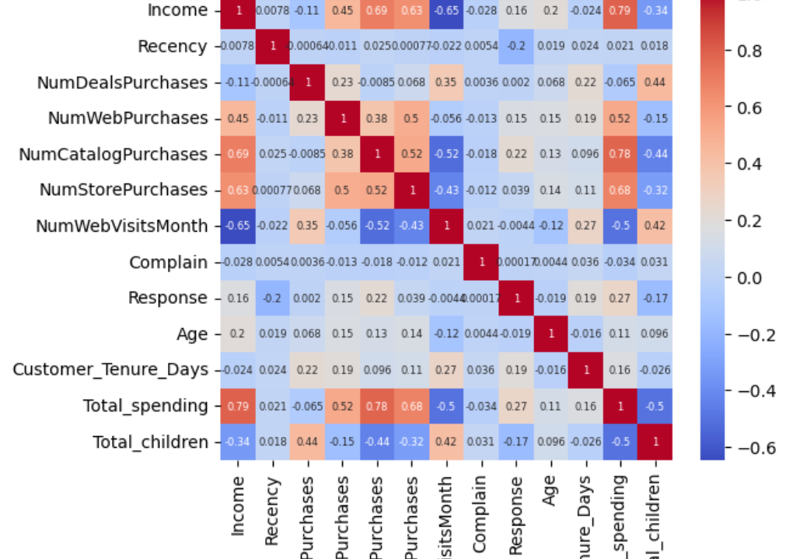
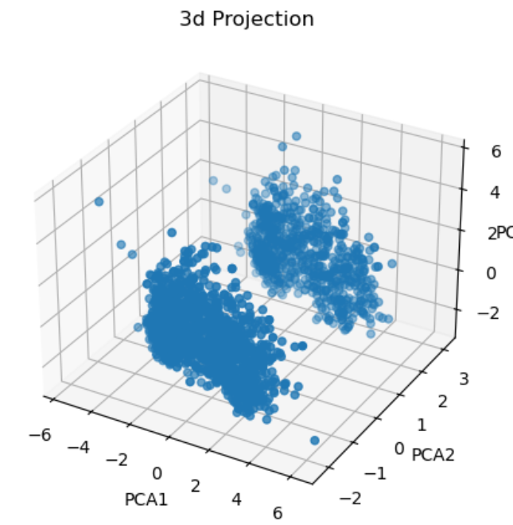
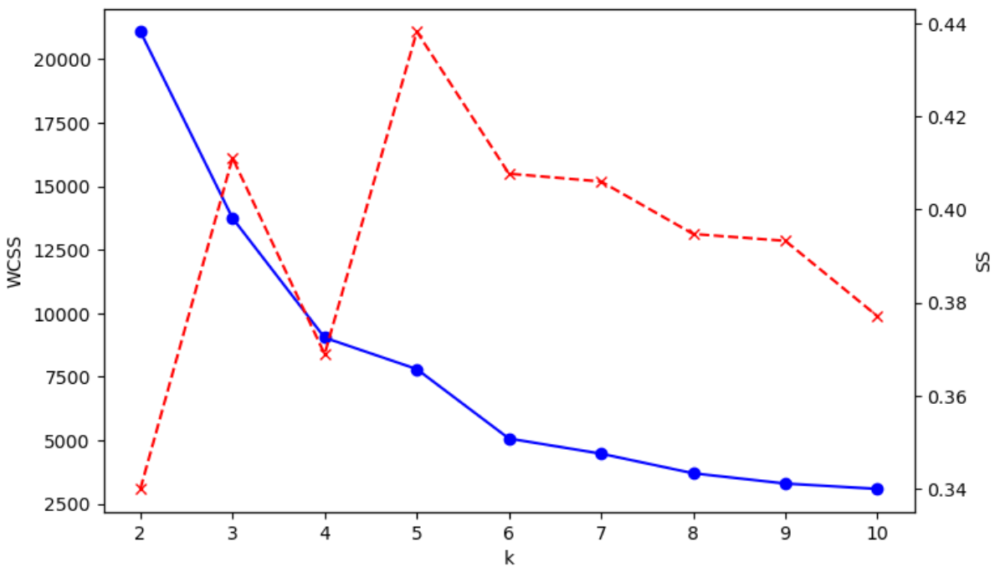
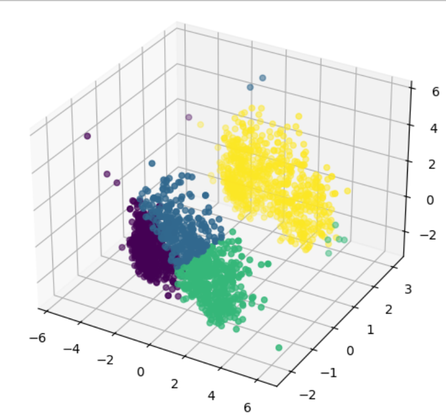
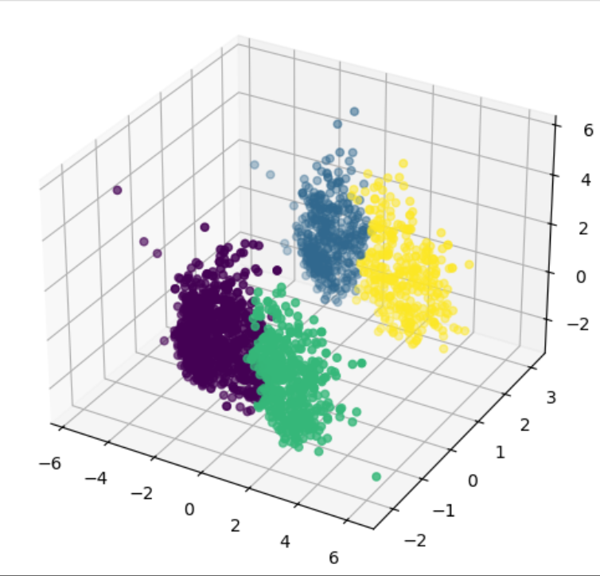
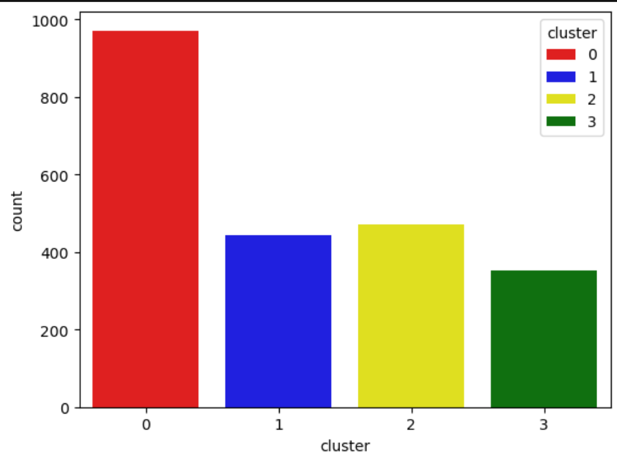

<h1 align="center">🛒 SmartCart Customer Segmentation System</h1>

<p align="center">Customer Segmentation using Machine Learning and Unsupervised Clustering</p>

<p align="center">
    
    
    
    
    
    
    
</p>

## Overview :

The SmartCart Customer Segmentation System is a Machine Learning project that segments customers into distinct groups based on demographic information and purchasing behavior. The project helps businesses better understand customer profiles, enabling personalized marketing strategies and improve customer engagement.

This project includes complete data preprocessing, feature engineering, exploratory data analysis, dimensionality reduction using Principal Component Analysis (PCA), and customer segmentation using clustering algorithms.

## Objective :

Businesses often have customers with different purchasing habits, incomes, and lifestyles. Treating every customer the same reduces the effectiveness of marketing campaigns.
The goal of this project is to identify similar groups of customers using unsupervised machine learning techniques so that businesses can target each customer segment more effectively.

## Dataset

The dataset contains customer information such as:

- Education
- Marital Status
- Income
- Year of Birth
- Customer Registration Date
- Product Spending
- Number of Children
- Campaign Responses
- Purchase Channels
- Website Visits
- Complaints

> **Note:** The dataset (`smartcart_customers.csv`) is not included in this repository.

# Workflow

## 1. Data Loading

- Loaded the customer dataset using Pandas.
- Examined the dataset using `df.info()`.

## 2. Data Cleaning

- Filled missing values in the **Income** column using the median.
- Converted customer registration dates into datetime format.

## 3. Feature Engineering

Created several new features:

- **Age**
- **Customer Tenure (Days)**
- **Total Spending**
- **Total Children**
- **Living_With**

Education categories were simplified into broader groups.

## 4. Data Preprocessing

- Removed unnecessary columns.
- Performed One-Hot Encoding on categorical variables.
- Standardized all features using StandardScaler.

## 5. Exploratory Data Analysis
Performed Pair Plot and Correlation Heatmap to understand relationships among features.

## 6. Outlier Removal
Removed extreme outliers based on Age and Income to improve clustering quality.

## 7. Principal Component Analysis (PCA)

- Applied PCA to reduce the dataset into three principal components.
- Generated a 3D visualization of the transformed data.

## 8. K-Means Clustering

- Implemented K-Means clustering on the PCA-transformed dataset.
- Used Elbow Method and KneeLocator to estimate an appropriate number of clusters.

## 9. Agglomerative Clustering

- Applied Agglomerative Clustering using Ward linkage.
- Generated 3D Cluster Visualization and Cluster Distribution Plot

## 10. Cluster Analysis

Calculated the average values of each feature within every cluster to better understand customer characteristics and purchasing behavior.

# Visualizations

The following visualizations were generated during the customer segmentation workflow.

## 1. Feature Relationship Pair Plot
- Explores relationships among key numerical features such as Income, Age, Total Spending, Recency, and Response before clustering (Figure not included due to large relationship showcase).

## 2. Correlation Heatmap
- Displays the correlation between numerical features to identify strong positive and negative relationships.
- 

## 3. PCA 3D Projection
- Customers projected onto the first three principal components after dimensionality reduction using PCA.
- 

## 4. Combined Elbow and Silhouette Plot
- Compares the Elbow Method (WCSS) and Silhouette Score to identify the optimal number of clusters, balancing compactness and separation.
- 

## 5. K-Means Clustering
- Visualization of customer clusters obtained using the K-Means algorithm after PCA dimensionality reduction.
- 

## 6. Agglomerative Clustering
- Visualization of customer clusters generated using Agglomerative Hierarchical Clustering with Ward linkage.
- 

## 7. Cluster Characterization
- Summary of average feature values for each cluster to understand customer purchasing behavior and demographics.
- 

## Project Structure
```text
SmartCart_Segmentation_System/
│
├── Smartcart_Customers_Segmentation.ipynb      # Main analysis notebook
├── README.md                                   # Project documentation
├── requirements.txt                            # Python dependencies
├── .gitignore                                  # Ignored files
├── plots/                                      # Generated visualizations
└── smartcart_customers.csv                     # Dataset (Not Included)
```

# Installation

Clone the repository:

```bash
git clone <repository-url>
```

Install the required libraries:

```bash
pip install pandas numpy matplotlib seaborn scikit-learn kneed
```

Place your own copy of `smartcart_customers.csv` inside the project folder.

Open the notebook and run all cells.

#  Future Improvements

- Interactive dashboard using Streamlit
- Customer recommendation system
- Automatic cluster profiling
- Real-time customer segmentation
- Model deployment using Flask or FastAPI

# Author - **Tannu Priya**